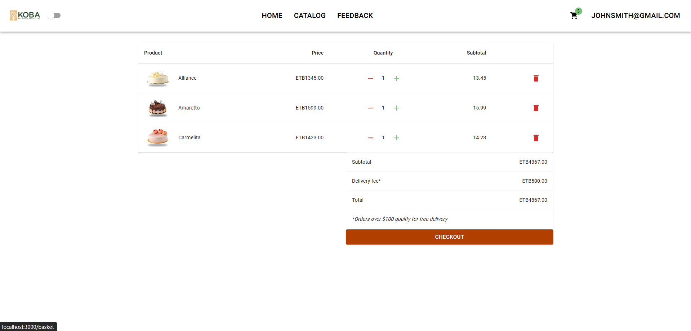

# KOBA Patisserie And Bakery E-commerce Website

## Overview

This project is an **E-commerce Website** built for **KOBA Patisserie and Bakery**, a local business. It enables customers to browse and purchase products online, with features like user authentication, product catalog, shopping cart, and order management. The backend is built with **.NET 6** and uses **SQLite** as the database for simplicity and local development.

Technologies used:

- **Backend**: .NET 6, Entity Framework Core, SQLite, Swagger
- **Frontend**: React, Axios, Daisy UI, Context API

---

## Table of Contents

- [Features](#features)
- [Technologies Used](#technologies-used)
- [System Requirements](#system-requirements)
- [Installation](#installation)
  - [Backend Setup](#backend-setup)
  - [Frontend Setup](#frontend-setup)
- [Running the Application](#running-the-application)
- [API Documentation](#api-documentation)
- [Screenshots](#screenshots)
- [Contributing](#contributing)
- [License](#license)

---

## Features

- **Product Catalog**: Browse products with categories and detailed descriptions.
- **Shopping Cart**: Add items to the cart and proceed to checkout.
- **Order Management**: Place and view orders.
- **User Authentication**: Secure login and registration for customers.
- **API**: Backend REST API built with .NET 6 and Entity Framework Core for data persistence using SQLite.
- **Frontend**: Developed with React and styled using Material UI for a clean and user-friendly interface.
- **Dark Mode**: Allows the user to change the interface into dark theme.
- **State Management**: Managed using React's Context API for global state across the app.
- **Axios**: Used for making API calls to the backend.
- **Swagger**: API documentation and testing integrated via Swagger.

---

## Technologies Used

### Backend (Server-side)

- **.NET 6**: Framework used to create the Web API.
- **Entity Framework Core**: ORM for interacting with the SQLite database.
- **SQLite**: Lightweight, file-based database used for simplicity.
- **JWT Authentication**: For secure user authentication.
- **Swagger**: Automatically generates API documentation.

### Frontend (Client-side)

- **React**: JavaScript library for building user interfaces.
- **Context API**: For state management across the application.
- **Axios**: For making HTTP requests to the backend API.
- **Daisy UI**: Tailwind CSS components for building a responsive UI.

---

## System Requirements

- **Node.js** (version >= 14)
- **.NET SDK** (version >= 6.0)
- **SQLite** (included with .NET)

---

## Installation

### Backend Setup

1. **Clone the repository**:

   ```bash
   git clone https://github.com/AbiyuNigussie/Koba_ecommerce.git
   cd karavan-cafe/API
   ```

2. **Install dependencies**:

   ```bash
   dotnet restore
   ```

3. **Update database connection**:

   - In `appsettings.json`, ensure the connection string points to a local SQLite file. The default setup uses SQLite in the project directory.

4. **Apply migrations**:

   ```bash
   dotnet ef database update
   ```

5. **Run the backend server**:
   ```bash
   dotnet run
   ```

### Frontend Setup

1. **Navigate to the frontend directory**:

   ```bash
   cd ../client
   ```

2. **Install dependencies**:

   ```bash
   npm install
   ```

3. **Run the frontend server**:
   ```bash
   npm run dev
   ```

---

## Running the Application

Once both backend and frontend servers are up and running, navigate to the following URLs:

- **Backend**: `https://localhost:5001/swagger` (for Swagger API documentation)
- **Frontend**: `http://localhost:3000` (for the React frontend)

---

## API Documentation

API documentation is automatically generated and available at the `/swagger` endpoint of your backend server:

```
https://localhost:5001/swagger
```

Use this to explore and test the available API endpoints, including user authentication, product management, and order processing.

---

## Screenshots

### Landling Page


### Product Catalog


### Product View


### Shopping Cart



### Register Page


### Signin Page


### Swagger API


---

## Contributing

Contributions are welcome! Follow these steps:

1. Fork the repository.
2. Create a new feature branch.
3. Commit your changes.
4. Push to your branch.
5. Open a pull request.

---

**Author**: Abiyu Nigussie  
**GitHub**: [https://github.com/yourusername](https://github.com/AbiyuNigussie)
